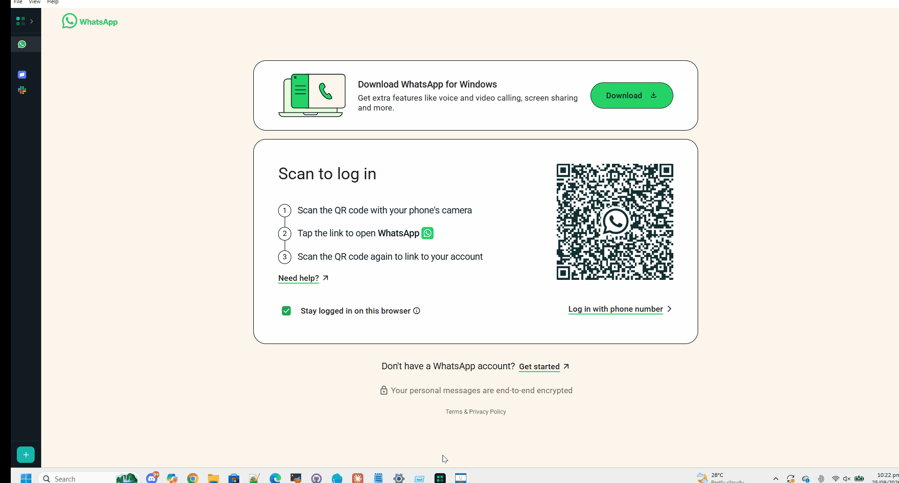

<div align="center">

# Multi Login

**Run isolated sessions of any web app side by side.**
WhatsApp, Stripe, Discord, hosting panels — each with its own cookies and login, in one window.



[](LICENSE)
[](#)
[](https://www.electronjs.org/)

[Download](#download) · [Features](#features) · [Security Model](#security-model) · [Architecture](docs/ARCHITECTURE.md) · [Contributing](CONTRIBUTING.md)

</div>

---

## Why

Browser profiles technically let you run multiple logged-in accounts, but switching between them is clunky enough that most people just don't bother — you end up signing out and back in, or juggling browser windows. Multi Login gives every account its own permanent, isolated session, visible in one sidebar:

- Two (or ten) Stripe dashboards for different client accounts, open at once
- Personal and work Discord, side by side
- Every client's Hostinger panel, one click away
- Multiple WhatsApp numbers, no phone-swapping

Nothing is shared between sessions — not cookies, not localStorage, not cache. Each one behaves like a completely separate browser profile.

## Features

- **Unlimited sites and sessions** — any URL works, not just the built-in presets (WhatsApp, Discord, Gmail, Stripe, GitHub, Slack, and more)
- **True isolation** — each session gets its own Electron session partition; logging into one never touches another
- **Notifications that route correctly** — a click on a notification focuses the app and switches straight to the session that sent it; the taskbar icon shows a running unread badge
- **Per-session mute** — silence one session's notifications and audio without affecting the rest
- **Smart link handling** — links to a different site (say, a YouTube link inside WhatsApp) open in a popup sharing the same session, instead of navigating you away; OAuth/SSO logins are excluded from this so they complete normally
- **"Open Link in Session"** — right-click any link, choose which session's cookies it should carry. This is what makes flows like a Stripe/Hostinger email-verification link work — open it in the exact browser context that's expecting it
- **In-app translation** — select text or an entire page, translate to any of 14 languages, right from the context menu
- **Spell-check suggestions** built in
- **Collapsed sidebar** with a hover flyout, so you can switch sessions without giving up screen space

See [`FEATURES_CONTEXT.md`](FEATURES_CONTEXT.md) for the full list.

## Download

Grab the latest portable `.exe` from [Releases](https://github.com/ahmedmemon785/multi-login/releases). No install required — just run it.

> The build isn't code-signed, so Windows SmartScreen may show a warning on first run. Click **More info → Run anyway**. (Signing costs money to maintain — happy to add it if there's real demand; open an issue.)

## Building from source

```bash
git clone https://github.com/ahmedmemon785/multi-login.git
cd multi-login
npm install
npm start          # run from source
npm run dist        # build dist/Multi-Login.exe
```

**Close the app before running `npm run dist`** — Windows locks a running exe's file, which will hang the build.

## Security Model

This app runs real login sessions for sites that matter (payment dashboards, hosting panels), so here's exactly what it does and doesn't do:

- **All data stays local.** Sessions live in `%APPDATA%\multi-login\Partitions\` — Electron's own per-partition cookie/storage store. Nothing is uploaded anywhere.
- **No password storage.** There is no password manager, no credential vault, no autofill. You log in to each session the normal way, through the site's own login page, and the site's own cookies keep you logged in — exactly like a regular browser tab.
- **Permissions are deny-by-default.** Only media (microphone/camera, for voice notes and video calls), fullscreen, and MIDI are auto-granted. Everything else — geolocation, clipboard access — is denied.
- **Translation is the only feature that leaves the sandbox on its own.** Selecting text and choosing "Translate" sends that text to Google's translate endpoint. Nothing else calls out unless you're already using the site you loaded.
- Full technical detail, including *why* each of these decisions was made, is in [`docs/ARCHITECTURE.md`](docs/ARCHITECTURE.md).

Found a real security issue? Please see [`SECURITY.md`](SECURITY.md) rather than opening a public issue.

## Limitations

- Windows only, for now
- No tab bar — one session visible at a time, switching via the sidebar
- Translation uses an unofficial Google endpoint and could be rate-limited without notice

## Contributing

Issues and PRs are welcome — see [`CONTRIBUTING.md`](CONTRIBUTING.md).

## License

[MIT](LICENSE) — use it, fork it, rebrand it, whatever you want.

---

<div align="center">

Built by **[Ahmed Memon](https://www.digisysalpha.com/)** — senior backend developer, available for freelance work.

[Website](https://www.digisysalpha.com/) · [GitHub](https://github.com/ahmedmemon785/) · [LinkedIn](https://www.linkedin.com/in/mohammad-ahmed-033aa198/) · [Email](mailto:ahmedmemon785@gmail.com)

</div>
